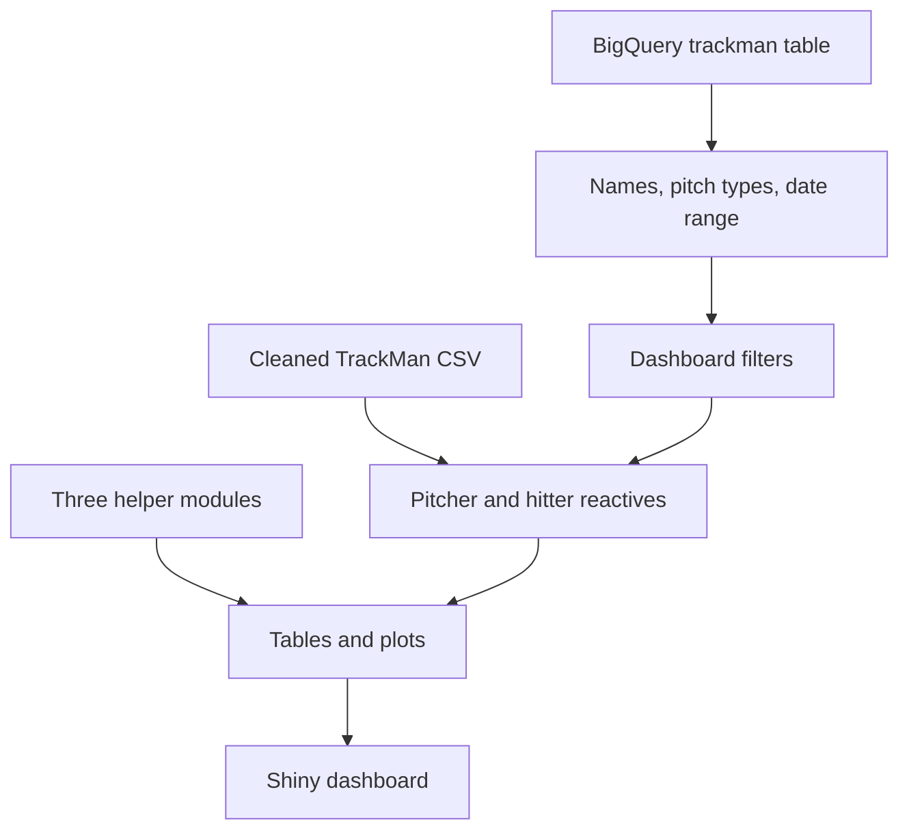

# UCLA Baseball Analytics Dashboard

An interactive **R Shiny dashboard** for analyzing UCLA baseball TrackMan data. The application provides separate pitcher and hitter workspaces with leaderboards, pitch-shape and batted-ball visualizations, location heat maps, game-by-game trends, advanced metrics, and side-by-side pitcher comparisons.

The project uses a hybrid data architecture:

- **Google BigQuery** supplies the available pitcher names, batter names, pitch types, and overall date range.
- A **local cleaned TrackMan CSV** supplies the pitch-level records used by the dashboard's tables, charts, filters, and statistical functions.
- Three local **helper modules** contain most of the analysis and plotting functions.

> [!IMPORTANT]
> `baseball_app.R` is not a standalone application. It will not run without the helper scripts, cleaned TrackMan data, Google Cloud credentials, and access to the configured BigQuery project and dataset.

## Features

### Pitcher analysis

- Filter UCLA pitching data by date, pitcher, batter side, pitch type, hit type, pitch call, and play result.
- Searchable pitching leaderboard with pitch count, velocity, spin rate, induced vertical break, horizontal break, and extension.
- Velocity-versus-spin, release-position, movement, location, and swing visualizations.
- Heat maps for count, exit velocity, launch angle, balls in play, swing rate, and whiff rate.
- Game-by-game trends for velocity, spin rate, extension, horizontal break, vertical break, and usage.
- Zone-location analysis and advanced statistics.
- Side-by-side pitcher comparison across metrics, graphics, heat maps, and trends.

### Hitter analysis

- Filter UCLA hitting data by date, hitter, pitcher handedness, pitch type, hit type, pitch call, and play result.
- Searchable hitting leaderboard with batted-ball measurements.
- Exit-velocity/launch-angle plot, spray chart, contour plot, radial chart, and swing visualization.
- Heat maps for count, exit velocity, launch angle, balls in play, swing rate, and whiff rate.
- Advanced batting statistics, by-pitch Statcast-style summaries, wOBA/xwOBA analysis, and an OPS chart.
- Swing-decision analysis and exit-velocity or launch-angle histograms.

### Application behavior

- Reset buttons restore pitcher or hitter filters.
- Loading spinners provide feedback while tables and plots render.
- Many expensive plots use Shiny's `bindCache()` to reuse results for identical filter combinations.
- Interactive `DT` tables support searching, sorting, and scrolling.

## Technology stack

- **UI and server:** Shiny and shinydashboard
- **Data manipulation:** data.table, dplyr, tidyverse, lubridate
- **Tables:** DT
- **Visualization:** ggplot2, plotly, gridExtra, ggforce, directlabels, latex2exp
- **UI utilities:** shinyjs, shinyWidgets, shinycssloaders, htmlwidgets
- **Data access:** DBI, bigrquery, RMySQL

`RMySQL`, `plotly`, and some other loaded packages may support helper-module or legacy functionality rather than code directly visible in `baseball_app.R`.

## Project structure

The app expects the following relative paths:

```text
project-root/
├── baseball_app.R
├── helper_functions/
│   ├── general_functions.R
│   ├── hitter_functions.R
│   └── pitcher_functions.R
├── data/
│   ├── V3 Merged Files Through 4-3 CLEANED.csv
│   └── clean_trackman_data.R        # referenced by a code comment; optional at runtime
└── Database Connecting/
    └── baseball-consulting-439523-1b0c04c432e7.json
```

Run the application from `project-root` so all relative paths resolve correctly.

## Prerequisites

- R 4.1 or newer is recommended.
- A Google Cloud project with BigQuery enabled.
- Permission to read `baseballdb.trackman`.
- Permission to bill BigQuery jobs to `baseball-consulting-439523`.
- A cleaned TrackMan CSV compatible with the helper functions.
- The three helper scripts listed above.

## R package installation

Install the packages loaded by the app:

```r
install.packages(c(
  "shiny",
  "shinydashboard",
  "data.table",
  "dplyr",
  "shinyjs",
  "shinyWidgets",
  "DT",
  "latex2exp",
  "shinycssloaders",
  "plotly",
  "tidyverse",
  "htmlwidgets",
  "ggplot2",
  "RMySQL",
  "DBI",
  "gridExtra",
  "ggforce",
  "lubridate",
  "directlabels",
  "bigrquery"
))
```

For reproducible deployments, consider initializing `renv` and committing the generated lockfile:

```r
install.packages("renv")
renv::init()
```

## Google BigQuery configuration

The current application authenticates from this local service-account key:

```text
Database Connecting/baseball-consulting-439523-1b0c04c432e7.json
```

It then connects with:

| Setting | Current value |
| --- | --- |
| Project | `baseballdb` |
| Dataset | `trackman` |
| Billing project | `baseball-consulting-439523` |
| Table queried | `baseballdb.trackman` |

At startup, the app queries BigQuery for:

- distinct pitchers;
- distinct batters;
- distinct tagged pitch types;
- the earliest and latest dates.

The `Date` column is parsed in SQL with `PARSE_DATE('%Y-%m-%d', Date)`, so BigQuery dates must be stored as strings in `YYYY-MM-DD` format unless the query is updated.

### Credential security

Never commit a Google service-account JSON key to source control. Add the credential path and other sensitive files to `.gitignore`, restrict the key to the minimum required IAM roles, and rotate it immediately if it has ever been exposed.

A safer deployment design is to provide credentials through the hosting platform's secret manager or application-default credentials instead of a repository file. The BigQuery project, dataset, billing project, and credential path should also be moved into environment variables.

Example `.gitignore` entries:

```gitignore
Database Connecting/*.json
.Rhistory
.RData
.Rproj.user/
.cache/
rsconnect/
```

## Local TrackMan data

The dashboard reads the same cleaned file twice:

```r
Trackman <- data.table::fread("data/V3 Merged Files Through 4-3 CLEANED.csv")
Trackman_csv <- read.csv("data/V3 Merged Files Through 4-3 CLEANED.csv")
```

`Trackman` is used by the reactive filters and most analyses. `Trackman_csv` is passed to the pitcher advanced-statistics function. The duplicate read increases memory usage but may exist because the helper functions expect different data-frame classes.

The main application directly references at least these columns:

| Category | Columns |
| --- | --- |
| Date and identity | `Date`, `Pitcher`, `Batter`, `PitcherTeam`, `BatterTeam` |
| Handedness | `PitcherThrows`, `BatterSide` |
| Pitch classification | `TaggedPitchType` |
| Pitch and play results | `PitchCall`, `PlayResult`, `HitType` |

The helper modules are expected to reference additional TrackMan fields for velocity, spin, movement, extension, release position, plate location, exit velocity, launch angle, batted-ball distance, and advanced metrics. Consult those helpers or the cleaning script for the complete schema contract.

The local CSV's `Date` field must be parsed into a date-compatible type by the cleaning pipeline or by `fread()`, because the app compares it directly with the Shiny date-range values.

## Running the application

1. Place `baseball_app.R` at the project root.
2. Add the three helper scripts under `helper_functions/`.
3. Add the cleaned TrackMan CSV under `data/`.
4. Configure BigQuery credentials and verify access to `baseballdb.trackman`.
5. Install the required R packages.
6. From the project root, run:

```bash
R -e "shiny::runApp('baseball_app.R')"
```

You can also open `baseball_app.R` in RStudio and select **Run App**.

## Data flow



## Dashboard reference

### Pitcher workspace

| Tab | Contents |
| --- | --- |
| Leaderboard | Pitcher averages for count, velocity, spin, movement, and extension |
| Graphical | Velocity/spin, release, movement, location, and swing plots |
| Heat Map | Count, batted-ball, swing, and whiff location heat maps |
| Trends | Game-by-game pitch characteristics and usage |
| Zone Location | Zone-location success plots arranged in a grid |
| Advanced | Advanced pitching statistics table |
| Comparison | Two-pitcher metrics, graphical views, heat maps, and trends |

### Hitter workspace

| Tab | Contents |
| --- | --- |
| Leaderboard | Hitter averages for count and batted-ball measurements |
| Batted Balls | EV/launch angle, spray, contour, radial, and swing charts |
| Heat Map | Count, batted-ball, swing, and whiff location heat maps |
| Advanced Metrics | wOBA/xwOBA, batting tables, OPS, swing decisions, and distributions |

The hitter **Pitch Tracking** and **Zones** sub-tabs are present as placeholders and do not currently contain outputs.

## Helper-function contract

Most calculations are delegated to functions sourced at startup. The app expects functions including:

### Pitching

`PitcherLeaderboard`, `VeloSpinPlot`, `ReleasePositionPlot`, `MovementPlot`, `LocationPlot`, `PitcherSwingPlot`, `bipHeatMapFunctionP`, `countHeatMapFunctionP`, `evHeatMapFunctionP`, `laHeatMapFunctionP`, `swingrateHeatMapFunctionP`, `whiffrateHeatMapFunctionP`, `veloTrendPlot`, `spinrateTrendPlot`, `extensionTrendPlot`, `horzbreakTrendPlot`, `vertbreakTrendPlot`, `usageTrendPlot`, `pitcherMetricsDF`, and `advancedstats_func`.

### Hitting

`HitterLeaderboard`, `EVLAPlot`, `EVLAPlot3`, `HitterContourPlot`, `radialPlot`, `HitterSwingPlot`, the hitter heat-map functions, `statcastTable`, `bypitchstatcastTable`, `xwOBAfunction`, `ops`, `swing_decis`, `histogramPlot`, and `zonelocationsucess`.

Because these definitions are outside `baseball_app.R`, this README can describe their role but cannot guarantee their exact formulas without the helper files.

## Filtering behavior

Pitcher data begins with records that:

- have a pitch type other than `Undefined` or `Other`;
- fall inside the selected date range; and
- have `PitcherTeam == "UCLA"`.

Hitter data begins with records that:

- have a pitch type other than `Undefined` or `Other`;
- fall inside the selected date range; and
- have `BatterTeam == "UCLA"`.

Additional selections are applied sequentially for player, handedness/side, pitch type, hit type, pitch call, and play result.

## Performance

The app caches most rendered plots using their filter inputs. This can substantially reduce repeat render time, but the cache is local to the Shiny process unless a persistent cache backend is configured.

For larger datasets or multi-user deployment, consider:

- querying filtered pitch-level data from BigQuery rather than loading a full CSV;
- using parameterized queries and database indexes/partitioning where applicable;
- loading the CSV only once;
- precomputing expensive summaries;
- configuring a persistent Shiny cache;
- closing database query results and the connection when the session/app exits.

## Known limitations and implementation notes

- BigQuery is used only to populate choices and date bounds; the analytics still use the local CSV. If the two sources differ, users may see choices that produce no local results or local players missing from selectors.
- The dynamically generated opposing-batter and opposing-pitcher controls are displayed, but the current `PitcherData()` and `HitterData()` pipelines do not apply those opponent selections.
- Several comparison outputs call the shared `PitcherData()` reactive. Verify that helper functions or comparison-specific logic actually apply `pitcherInput1` and `pitcherInput2`; otherwise both sides may receive the same filtered dataset.
- BigQuery project, dataset, table, billing project, credential path, team name, CSV filename, and several categorical choices are hard-coded.
- Startup requires network access and valid Google authentication even though the analysis data is local.
- Authentication and database connection occur at application startup, with no user-facing recovery path for missing credentials or unavailable BigQuery.
- Query result objects and the database connection are not explicitly cleared or disconnected.
- Empty selections may cause warnings or errors in helper functions unless those functions validate zero-row inputs.
- Some categorical choices contain likely legacy inconsistencies or typos, including `PopUp`/`Popup`, `CaightStealing`, and `undefined `.
- UI comments and variable names indicate an in-progress migration from local-only data to BigQuery.
- There is no package lockfile, automated test suite, schema validation, or continuous-integration configuration shown in this file.

## Recommended next steps

1. Decide on one source of truth: BigQuery or the local CSV.
2. Move credentials and database identifiers to environment variables.
3. Add explicit TrackMan schema validation at startup.
4. Apply the opponent filters or remove them from the UI.
5. Verify and, if needed, correct the two-pitcher comparison filtering.
6. Consolidate categorical values in the cleaning pipeline.
7. Add `renv`, smoke tests, and deployment documentation.
8. Add access controls before exposing identifiable player data.

## Data privacy

TrackMan exports and player-level performance data may be confidential team information. Do not publish the source CSV, credentials, or unrestricted dashboard without authorization. Use least-privilege IAM, authenticated Shiny hosting, encrypted secret storage, and an appropriate repository visibility setting.

## License

No license is specified by `baseball_app.R`. Add a `LICENSE` file only after confirming the intended ownership and distribution terms.
